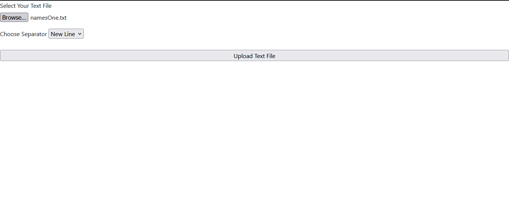
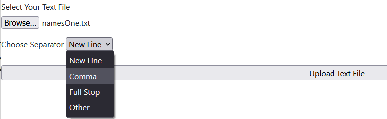
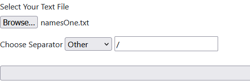
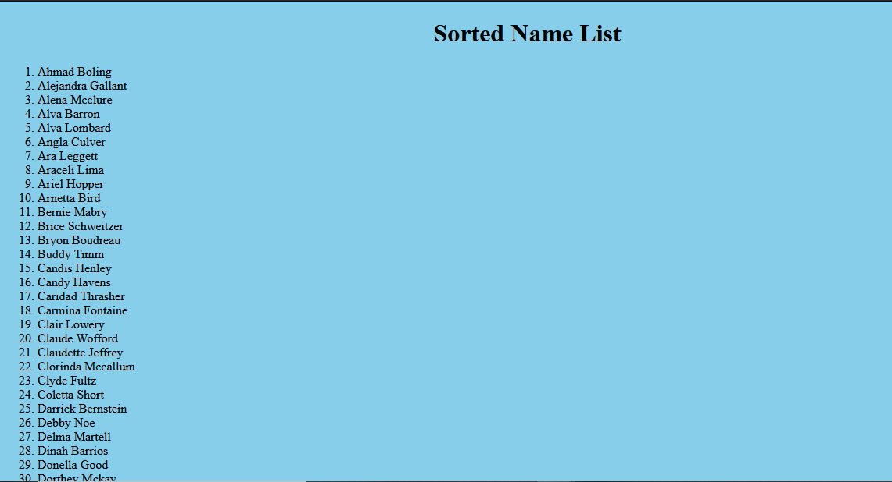

# Text File Content Sorting

The application let user to upload a text file and sort the content seperated as line

## How to run

```
npm install

node index.js
```


## How to Use

1. Navigate to the http://localhost:3000 and Upload the text file



2. Choose how the line should Seperate ex Using New Line, Comma, Fullstop



3. If there is an custom seperate element choose other and add in the text box



And click upload, The the Sorted Name List will appear as below




